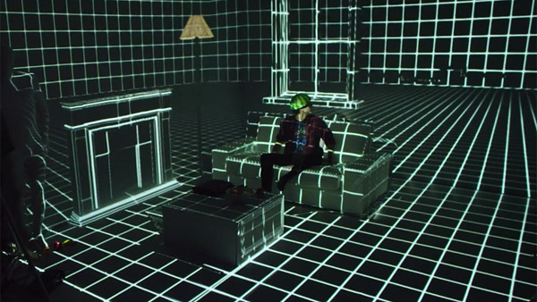
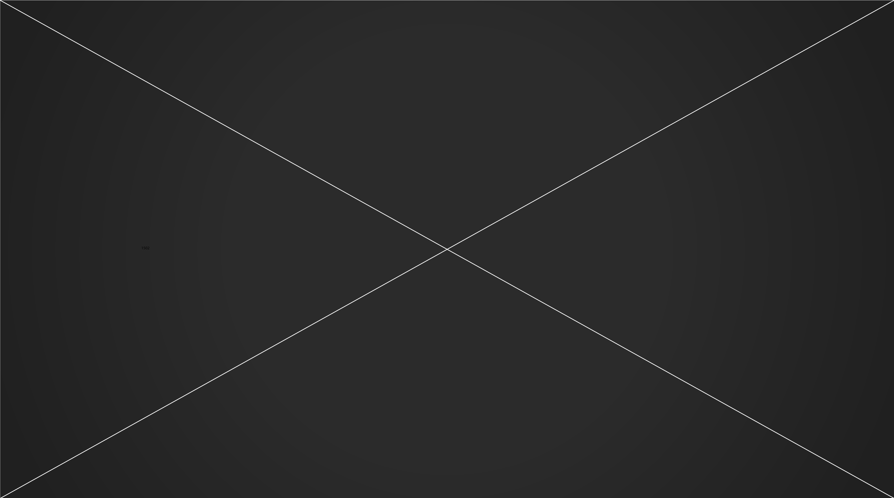
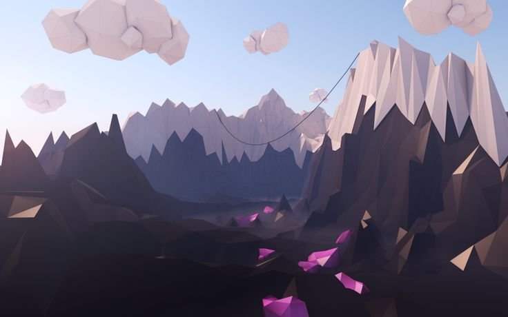

## A dark screen

* A blink of light, and a webpage loads.
* Wikipedia. Floating in a virtual viewport in front of user. An article
* History of astronomy. "We used to think earth was center of universe."
* "Our understanding changed".
* Another webpage loads. 
* An old [news broadcast](https://www.youtube.com/watch?v=GWy1YGNlNEU) on the beginnings of the internet...
* Another webpage. Steve Jobs introducing iPhone. "The internet in your pocket".
* ...Fade to black

..

..

---

## A blinking prompt

* http://www.thefutureoftheweb.com
* Press _Enter_
* Blink... GO...
* Glitches and pops and loading and pulsing and movement _into_ the web.
* "2D" becomes "3D". "Page" becomes "World". 

..

..

---

## A stage takes form

* Structure emerges from chaos... 
* Wireframes resolve, white on black. Like the holodeck.
* A stage forms, and holds... Pulsing, doing something... Loading...

..

..

---

## A transition

* The edges of the stage peel apart, fragment, flaking away... 
* Like a cocoon disolving...
* Revealing something beyond...

..

..

---

## A world

* "Whoa" moment... The first time we have ever seen the VR web...
* We are standing in a great wide open world... 
* We are looking around... it is 3D, immersive. Sounds echo in the distance.
* There is movement, and life. Clouds, water ripples, birds...
* Music can be heard faintly...

..

..

---

## First footsteps

* We look, and the world responds (eg plants grow where our gaze falls)
* We touch, and the world responds (eg ripples on water where we click)
* We lean forward, and we fly...
* Skimming over the surface of the land... flying over water, then land...
* Feeling the sensation of movement, and taking in the beauty...

..

..

---

## Discovery

* A light in the distance...
* We move towards it...
* It draws nearer, and is revealed to be a doorwawy. A portal...
* We step into it...

..

..

---

## Transported

* The world distorts and ripples
* We are aware of whooshing through space
* The old world falls away
* And a new one resolves

..

..

---

## Exploring the next world

* _TODO: design this world_

..

..

---

## Jumping back to the previous world

* We step back towards the portal that brought up to this world. _TODO: interaction specifics._ 
* We warp back into the landing world...

..

..

---

## Night time

* We are standing in moonlight...
* The time of day has changed while we were through the portal... It is nighttime now. A moon is overhead. It casts a white blue light over the landscape and ripples on the water...
* Another light is visible in the distance...
* We move towards it...

..

..

---

## We discover another portal

* _TODO_

..

..

---

## We step through it, into another world

* _TODO_

..

..

---

## Exploring this world

* * _TODO: design this world_

..

..

---

## Jumping back to the previous world

* We step back towards the portal that brought up to this world. _TODO: interaction specifics._ 
* We warp back into the landing world...

..

..

---

## Another light in the distance

* We are standing in the rain...
* It is daytime again, but fog and rain surrounds us...
* Another light is visible in the distance...
* We move towards it...

..

..

---

## We discover another portal

* _TODO_

..

..

---

## We step through it, into another world

* _TODO_

..

..

---

## Exploring this world

* * _TODO: design this world_

..

..

---

## Jumping back to the previous world

* We step back towards the portal that brought up to this world. _TODO: interaction specifics._ 
* We warp back into the landing world...

..

..

---

## A voice

* A presence tells us we have discovered all three worlds
* The presence makes itself known... Introduces itself...
* It joins us! This is how we get our HUD.
* _TODO: specifics_

..

..

---

## Trying out the HUD

* The HUD lets us do _TODO_
* We try it out for the first time...
* We tap on a bookmark...
* The world shimmers, and we are transported...

..

..
